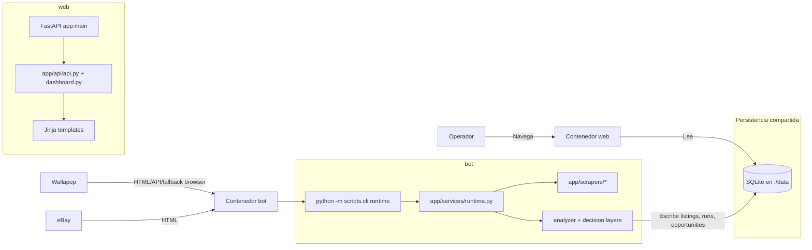

# Container Flow - Market Analyzer

## Scope
- Muestra los contenedores runtime principales y cómo se conectan.
- No detalla funciones internas ni modelo de datos.

## Assumptions
- Assumption: `web` sirve FastAPI y `bot` ejecuta el runtime continuo.
- Assumption: ambos comparten la misma carpeta `./data` para SQLite.

## Diagram

## Notes
- No hay cola ni cache distribuida en esta fase.
- SQLite es el punto de intercambio entre runtime y dashboard.
