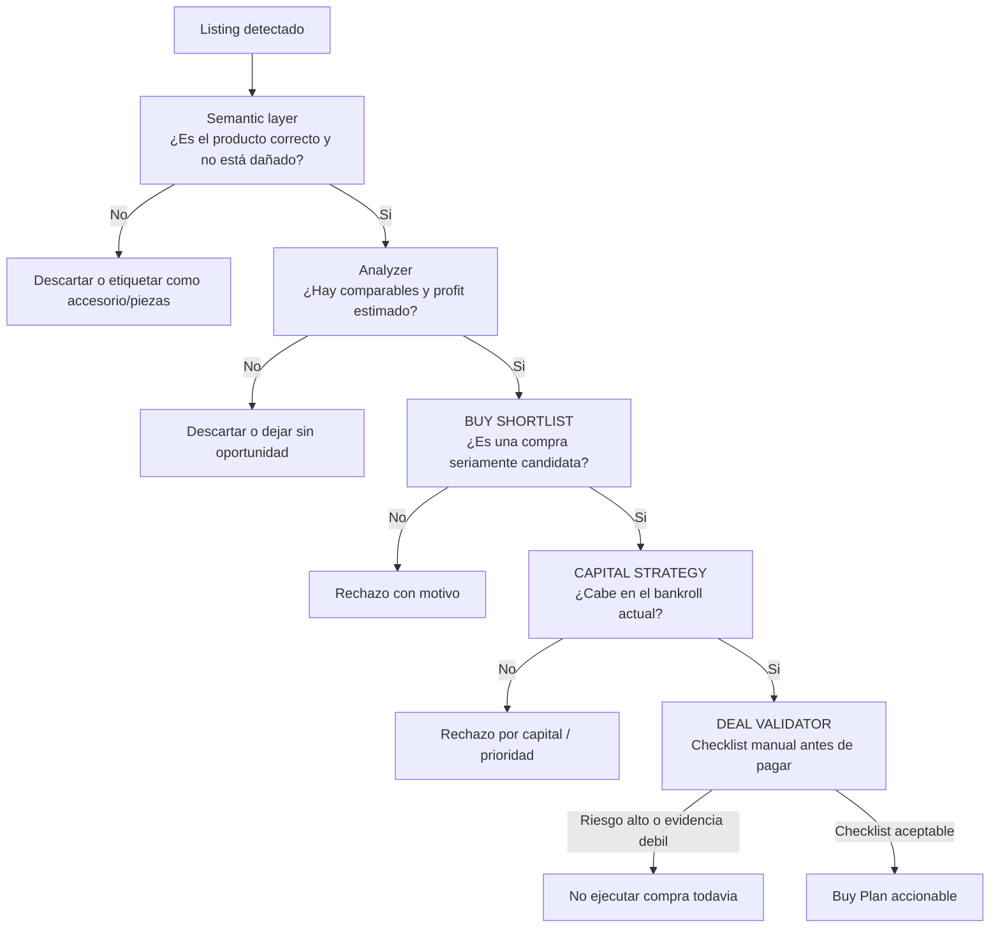

# Decision Flow - Market Analyzer

## Scope
- Muestra como una oportunidad cruza las capas de decision.
- No sustituye el detalle economico del analyzer.

## Assumptions
- Assumption: una listing barata no es automaticamente una compra.
- Assumption: capital y validacion manual pueden bloquear una oportunidad buena.
- Assumption: la capa semantica descarta accesorios, piezas y dañados antes de llegar al scorer.

## Diagram

## Notes
- Este flujo refleja la filosofia del producto.
- La decision final no es solo matematica; tambien incluye riesgo y evidencia.
- La semantica reduce ruido multilenguaje antes de gastar analisis de mercado.
