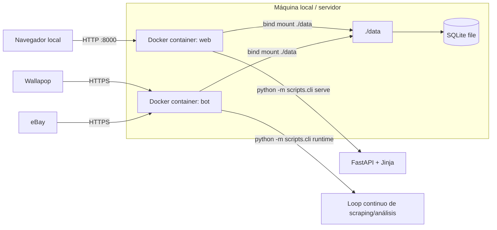

# Deployment - Market Analyzer

## Scope
- Muestra donde corre cada parte del sistema en local y Docker.
- No cubre observabilidad avanzada ni entornos productivos separados.

## Assumptions
- Assumption: el desarrollo actual corre en Docker Compose.
- Assumption: la carpeta `./data` se monta en ambos contenedores.

## Diagram

## Notes
- No hay cola separada ni worker pool distribuido.
- La simplicidad de despliegue es una ventaja ahora, pero SQLite concentra bastante responsabilidad.
