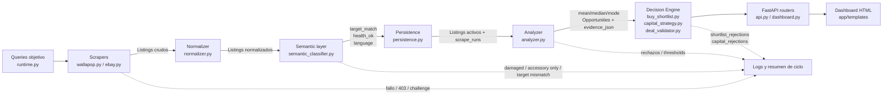

# Pipeline Component - Market Analyzer

## Scope
- Muestra las responsabilidades internas del pipeline backend.
- No entra en cada helper privado ni en cada clase de soporte.

## Assumptions
- Assumption: `comparable_key` es la pieza central para agrupar listings comparables.
- Assumption: la capa de decision layers consume opportunities ya calculadas.
- Assumption: la capa semantica solo marca `1/0` y una razon corta antes de persistir.

## Diagram

## Notes
- El normalizer no decide compra.
- La capa semantica no decide compra final, solo filtra y etiqueta.
- El analyzer no mezcla UI.
- Las decision layers separan oportunidad, capital y validacion.
