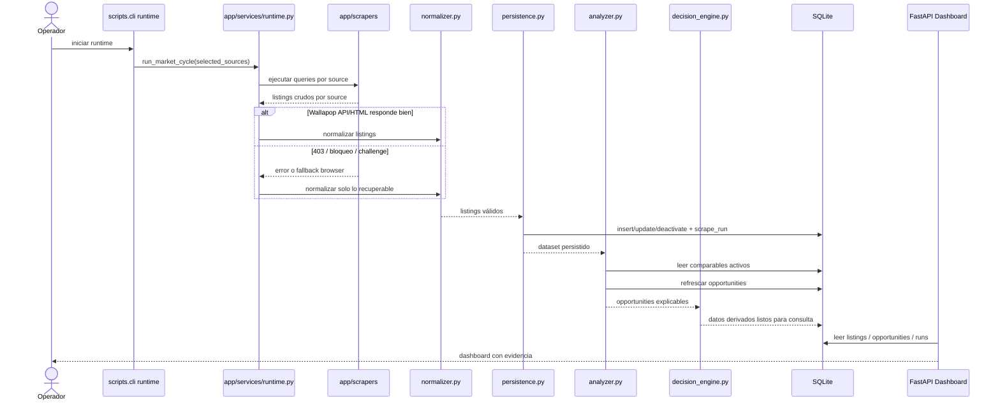

# Runtime Sequence - Market Analyzer

## Scope
- Muestra un ciclo real de scraping, normalizacion, persistencia y consulta en dashboard.
- Incluye el camino de fallo parcial cuando una fuente bloquea acceso.

## Assumptions
- Assumption: el runtime puede ejecutarse por ciclos con `scripts.cli runtime`.
- Assumption: la salida del dashboard depende de lo persistido en SQLite.

## Diagram

## Notes
- El dashboard no hace scraping.
- El runtime tolera fallos parciales por fuente.
