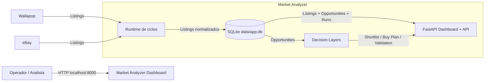

# System Context - Market Analyzer

## Scope
- Muestra actores, fuentes externas y salidas del sistema.
- No muestra detalles internos de clases ni tablas.

## Assumptions
- Assumption: el usuario consulta el dashboard local por HTTP en `localhost:8000`.
- Assumption: Wallapop y eBay son fuentes externas de listings.

## Diagram

## Notes
- El sistema no es solo scraping.
- La parte visible para el usuario es el dashboard, pero la decisión se genera antes en backend.
